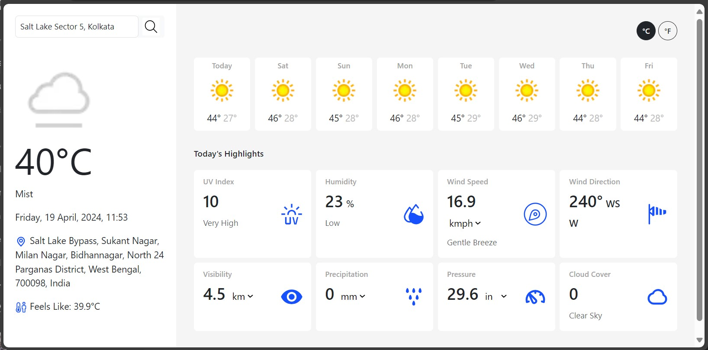

# Weather App

## Contents

1. [Features](#features)
2. [Setup Instructions](#setup-instructions)
3. [References](#references)

## Features

### On page load, default data is displayed

When page is first loaded, weather data is fetched for **Kolkata** by default and displayed. After this, user can search for any other location and get the corresponding weather data.


### Loader during data fetch

When data is being fetched from Geocoding or Weather API, a loader is displayed. When data has been fatched and is ready to be displayed, loader is hidden.


### Search field autofocus

When page is loaded, the search input field is automatically focused so that users can start typing right away without needing to manually click on the input field.

### Any location search and weather information

Users can search for any location (or address) and the weather details for the corresponding location will be displayed. This works for city names, addresses, street names, etc. This feature is enabled with the help of Geocoding API which returns the location data which closely matches the search string provided as input.

**Note:** As the Geocoding API matches locations which closely matches the input provided, sometimes, this can provide undesirable output. For example, we might want to get information about _Salt Lake Sector 5_ in _Kolkata_, but if we just search for _Salt Lake Sector 5_, it might return data for _Salt Lake, United States_. In such cases, providing more information will resolve the issue. For example, giving _Salt Lake Sector 5, Kolkata_ will fetch the correct data.

### Current weather information

The following weather information are displayed for the current day.

* Temperature
* Weather condition (like cloudy, sunny)
* Feels like temperature
* UV Index
* Relative humidity
* Wind Speed
* Wind direction
* Visibility
* Precipitation
* Pressure
* Cloud cover

All temperature data can be displayed either in Celsius or Fahrenheit. A toggle button is implemented which helps to toggle between these 2 temperature scales.




For some of the individual cards, the displayed metric can be changed as well. Below is the list of metrics which can be changed to a different metric and their acceptable metrics:

* Wind speed - _km/h_ and _mph_
* Visibility - _km_ and _mi_
* Precipitation - _mm_ and _in_
* Pressure - _in_ and _mb_

where

1. km = kilometers
2. mi = miles
3. km/h = kilometers per hour
4. mph = miles per hour
5. mm = millimeters
5. in = inches
6. mb = millibars


### Future weather prediction

Weather data for future 7 days is displayed in the predictions section. Per each card, the following inforamtion is displayed:

* Day of week
* Image of the average weather condition
* Maximum temperature
* Minimum temperature

### Error handling

An appropriate error message is displayed if there is any error in the app, for example, if user enters a location which cannot be matched to any supported location by the Geocoding API, then an error message is shown.

Also, after an error occurs, the last successfully fetched data is shown in the weather informatin sections.


## Setup Instructions

**Step 1:** Clone the GitHub repository in local system.

```bash
git clone https://github.com/soumalyapakrashi/simple-weather-app.git
```

**Step 2:** Open the downloaded folder in [VSCode](https://code.visualstudio.com/) (or any other editor of choice).

**Step 3:** Install the _Live Server_ extension of VSCode by Ritwick Dey from the _Extensions_ tab (or respective Live Server application for editor of choice).


**Step 4:** Open the `index.html` file in VSCode and click on the _Go Online_ button. It will open the website in the default browser.


## References

1. UI Kit: [Bootstrap 5](https://getbootstrap.com/)
2. Geocoding API: [Nominatim](https://nominatim.org/)
3. Weather API: [The WeatherAPI](https://www.weatherapi.com/)
4. Wind Categories referenced from [The Beaufort Wind Scale](https://www.rmets.org/metmatters/beaufort-wind-scale)
5. UV Index ranges referenced from [United States Environmental Protection Agency](https://www.epa.gov/sites/default/files/documents/uviguide.pdf)
6. Humidity Categorization Data from [ResearchGate](https://www.researchgate.net/figure/Relative-humidity-categorization_tbl1_42385503)
7. Icon SVGs from [SVGRepo](https://www.svgrepo.com/).
